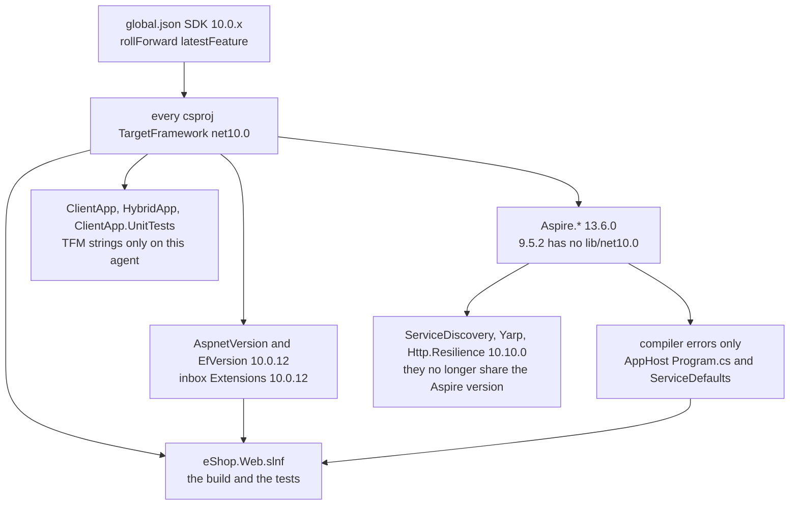

# Design doc (lite): eShop .NET 8 to .NET 10 dry run

run-id: 2026-10-05-eshop-net10-b130
branch: publix-dryrun-net10 off release/8.0 at f236952
shape: lite. The task already fixed a surgical dry run, so a 15-section review doc would not change the decision.

## Summary

`release/8.0` builds eShop as `net8.0` with SDK `8.0.400` in `global.json`. This dry run retargets that same tree to `net10.0` on `publix-dryrun-net10` so Wednesday's live upgrade can follow a path that already restored and built. `release/8.0` stays at `f236952`. Nothing merges.

## Goals and non-goals

Goals:

- Every `net8.0` target framework string becomes `net10.0`, including the MAUI platform suffixes and the two `ClientApp.csproj` conditions that compare the literal `net8.0`.
- `global.json` asks for a 10.0 SDK. `rollForward` stays `latestFeature`, so a newer 10.0 patch still satisfies it.
- Package versions in `Directory.Packages.props` move only when a `net10.0` project cannot restore or compile against the current pin.
- `dotnet build eShop.Web.slnf` succeeds. High-signal tests in that filter run. The PR body carries the bumps, the gotchas, and a talk track.

Non-goals:

- Do not port `main`. That branch already sits on SDK `10.0.302` and Aspire `13.6.0`, but it also rewrites `src/eShop.AppHost/Program.cs` into `AppHost.cs`, replaces the OpenAPI helpers, and switches tests to Microsoft.Testing.Platform. Those are product changes, not the upgrade.
- Do not edit EF migration snapshots just because they still say `ProductVersion` 8.0. They are generated history.
- Do not rewrite README, workflows, or identity/auth behavior. `README.md:38` still says "Install the latest .NET 8 SDK". That is a talk-track note, not a code change.
- Do not build the MAUI workload on this Linux agent. `eShop.Web.slnf` excludes `ClientApp`, `HybridApp`, and `ClientApp.UnitTests`. Their target strings still get updated so the repo is not half-upgraded.

## Architecture

The version pins are the system. A project does not pick its own ASP.NET version. `Directory.Packages.props` does, and `global.json` decides which SDK is allowed to read those projects.

Lucid is not connected in this session. The diagram is mermaid in this file.

What has to move together:

| Pin | Today | Dry-run value | Why this value |
|---|---|---|---|
| `global.json` `sdk.version` | `8.0.400` | `10.0.100` | Amended from `10.0.302`. Microsoft download hosts are blocked here, and Ubuntu noble only has SDK `10.0.112`. `latestFeature` from `10.0.100` accepts that package and also the `10.0.302` pin on `main`. |
| `AspnetVersion` | `8.0.7` | `10.0.12` | Latest stable 10.0 ASP.NET packages on NuGet. These packages sit on top of the shared framework. |
| `EfVersion` | `8.0.8` | `10.0.12` | Same band as ASP.NET, so EF tools and the shared framework match. |
| Inbox `Microsoft.Extensions.*` at `8.0.0` to `8.0.2` | those literals | `10.0.12` | `Directory.Build.props` sets `TreatWarningsAsErrors`. An old inbox pin becomes a failed build, not a warning. |
| `AspireVersion` | `8.2.0` | `13.6.0` | `Aspire.Hosting.AppHost` 9.5.2 ships `lib/net8.0` and `lib/net9.0` only. 13.0.0 is the first release with `lib/net10.0`. 13.6.0 is the newest stable and the version `main` uses. |
| `AspireUnstablePackagesVersion` | `8.0.0-preview.8.24258.2` | `13.6.0-preview.1.26479.8` | `Aspire.Azure.AI.OpenAI` has no stable 13.6.0. That preview is the newest. |
| `Microsoft.Extensions.ServiceDiscovery` and `.Yarp` | `$(AspireVersion)` | `10.10.0` | NuGet has no 13.6.0 of these packages. They split onto the 10.x extensions line. |
| `Microsoft.Extensions.Http.Resilience` | `8.7.0` via `MicrosoftExtensionsVersion` | `10.10.0` | Same split. 8.7.0 is not a net10 build of that package. |
| `Npgsql.EntityFrameworkCore.PostgreSQL` | `8.0.4` | `10.0.3` | The 8.0 provider does not target EF Core 10. |
| `Pgvector.EntityFrameworkCore` | `0.2.1` | `0.3.0` | 0.3.0 is what `main` pairs with EF 10. Bump only if 0.2.1 fails to compile. |
| MAUI `Microsoft.Maui.Controls` and friends | `8.0.70` or `8.0.80` | `10.0.110` | A `net10.0-android` head cannot reference Maui 8. These three projects opt out of central versions, so the bump is inline. |

Leave Grpc, Duende, OpenTelemetry, Swashbuckle, Polly, MediatR, and xUnit where they are until restore or the compiler names them.

## Data model

No entity, table, or migration changes. Ownership of version data:

- SDK band: `global.json`.
- Shared package versions: the properties at the top of `Directory.Packages.props`, then the `PackageVersion` items that reference them.
- MAUI versions: `Version` attributes in `src/ClientApp/ClientApp.csproj`, `src/HybridApp/HybridApp.csproj`, and `tests/ClientApp.UnitTests/ClientApp.UnitTests.csproj`, because those projects set `ManagePackageVersionsCentrally` to false.

`ClientApp.csproj` line 16 sets `OutputType` to `Exe` only when `TargetFramework` is not the literal `net8.0`. That literal has to become `net10.0` or the headless build stops being a library. Line 42's `Debug|net8.0-ios|AnyCPU` condition has to match the new iOS target or the iOS debug property group never applies.

## API and interface contracts

No HTTP route, event payload, or public method is meant to change. The contract that does change is the build contract: consumers of these projects must have a 10.0 SDK, and `Aspire.Hosting.AppHost` 13.6.0 may rename hosting methods that `src/eShop.AppHost/Program.cs` and the two functional fixtures call.

Allowed code edits are the ones the compiler reports after the package bump, in the files that already call Aspire or the ASP.NET APIs that moved. Replacing `Program.cs` with `main`'s `AppHost.cs` is not allowed. Identity, basket, and order HTTP shapes stay.

## Security

Authentication stays Duende IdentityServer at `DuendeVersion` 7.0.6 and the JWT bearer package, now at `10.0.12`. No new secret, no new permission, no change to token validation. If a 10.0.12 API forces a call-site edit in `src/eShop.ServiceDefaults`, the edit keeps the same scheme and the same authority. It does not weaken validation to get the build green.

## Alternatives considered

Stay on Aspire 9.5.2. Rejected. Its `Aspire.Hosting.AppHost` package has no `net10.0` asset, so the AppHost project cannot resolve it.

Copy `main`'s `Directory.Packages.props` and AppHost rewrite. Rejected. That diff also changes the test runner, OpenAPI, and a large set of unrelated packages. The live demo would not look like an upgrade of `release/8.0`.

Retarget only the projects inside `eShop.Web.slnf`. Rejected. The user asked for TargetFrameworks, and a later MAUI build would still be on `net8.0` inside a repo whose SDK pin is 10.0. `rollForward: latestFeature` would then refuse the 8.0 MAUI projects anyway, because a 10.0 SDK does not satisfy an 8.0.400 pin.

## Testing strategy

Proof command, from `.github/workflows/pr-validation.yml`: `dotnet build eShop.Web.slnf` then `dotnet test eShop.Web.slnf`.

High-signal subset when the full filter needs Docker: the unit test projects in that filter (`tests/Ordering.UnitTests`, `tests/Basket.UnitTests`, and any other non-Aspire unit project the filter contains). `tests/Catalog.FunctionalTests/CatalogApiFixture.cs` and `tests/Ordering.FunctionalTests/OrderingApiFixture.cs` call `DistributedApplication.CreateBuilder` and start Postgres containers. Run them if a container runtime is available. If it is not, say so and quote the unit-test run. Do not treat a skipped functional suite as a green full suite.

## Risks

Aspire 13 will not compile the Aspire 8 call sites unchanged. The dry run should hit that error, fix the smallest call site, and write the before-and-after into the talk track. That is the moment Wednesday's audience will see.

`TreatWarningsAsErrors` in `Directory.Build.props` means a new net10 analyzer warning fails the build. Fix the warning in the file that emits it. Do not turn the property off.

Functional tests need Docker. This agent may not have it.

MAUI package bumps will not be executed here. A Windows build of `ClientApp` can still fail for a reason this dry run did not see.
